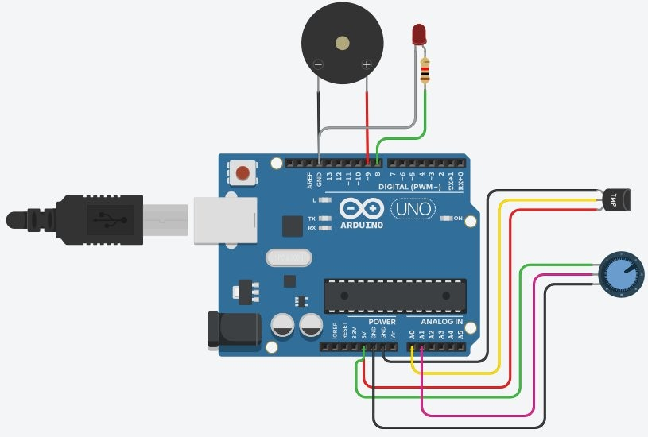
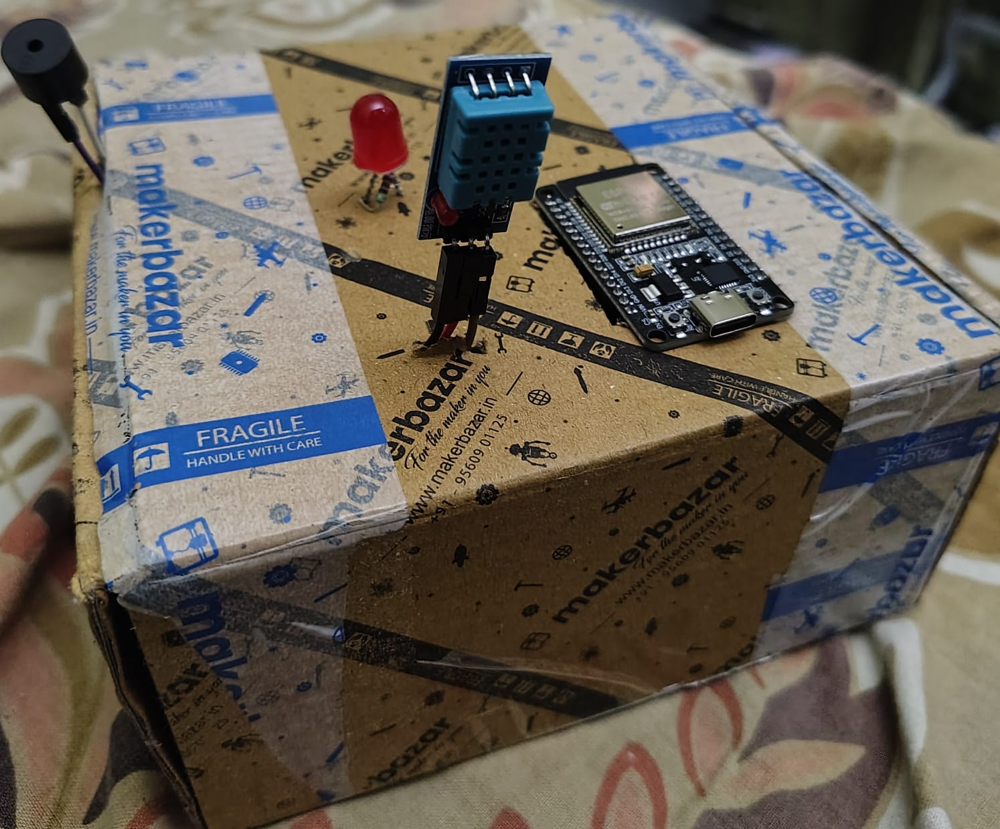

# 🌡️ ESP32 Environment Monitoring System

## Overview

The **ESP32 Environment Monitoring System** is an IoT-based solution designed to continuously monitor environmental conditions and automatically alert users when abnormal temperature or humidity levels are detected.

The system utilizes an **ESP32 microcontroller** and a **DHT11 sensor** to collect real-time environmental data. It integrates Wi-Fi connectivity, automated email notifications, LED indicators, and buzzer alerts to provide reliable environmental monitoring and anomaly detection.

This project demonstrates practical applications of **Embedded Systems**, **IoT Communication**, **Sensor Interfacing**, and **Real-Time Alert Systems**.

---

## Features

✅ Real-time Temperature Monitoring

✅ Real-time Humidity Monitoring

✅ ESP32-Based IoT Architecture

✅ Wi-Fi Connectivity

✅ Automatic Wi-Fi Reconnection

✅ Threshold-Based Anomaly Detection

✅ Automated Email Notifications

✅ LED Alert Indicators

✅ Buzzer Alert System

✅ Sensor Failure Detection

✅ Continuous Environmental Monitoring

---

## Hardware Components

| Component                 | Purpose                          |
| ------------------------- | -------------------------------- |
| ESP32                     | Main microcontroller             |
| DHT11 Sensor              | Temperature and humidity sensing |
| LED                       | Visual alert indication          |
| Buzzer                    | Audible alert indication         |
| Breadboard & Jumper Wires | Circuit connections              |
| USB Power Supply          | Power source                     |

---

## Software & Libraries

### Development Environment

* Arduino IDE

### Libraries Used

* WiFi.h
* DHT.h
* ESP Mail Client
* ESP32 Core Libraries

---

## System Architecture

```text
DHT11 Sensor
      │
      ▼
    ESP32
      │
      ├── LED Alert
      │
      ├── Buzzer Alert
      │
      └── Wi-Fi Network
              │
              ▼
      Email Notifications
```

---

## Working Principle

1. ESP32 connects to the configured Wi-Fi network.
2. DHT11 sensor continuously measures temperature and humidity.
3. Sensor values are validated and processed.
4. Readings are compared against predefined threshold values.
5. If abnormal conditions are detected:

   * LED indicator turns ON.
   * Buzzer alarm is activated.
   * Email notification is automatically sent.
6. ESP32 continues monitoring in real time.
7. If Wi-Fi connectivity is lost, the system automatically attempts reconnection.

---

## Project Structure

```text
esp32-environment-monitoring-system/
│
├── abc.ino
├── README.md
├── LICENSE
│
├── report/
│   └── ESP32_Environment_Monitoring_Report.pdf
│
└── images/
    ├── hardware_setup.jpeg
    ├── circuit_diagram.jpeg
    ├── ltspice_schematic.png
    └── ltspice_waveform.png
```

---

## Alert Mechanism

### Visual Alert

* LED indicator activates when threshold values are exceeded.

### Audible Alert

* Buzzer alarm provides immediate local notification.

### Remote Alert

* SMTP-based email notifications are automatically sent to the configured recipient.

---

## Applications

* Smart Home Monitoring
* Server Room Monitoring
* Greenhouse Monitoring
* Laboratory Monitoring
* Industrial Environment Monitoring
* IoT-Based Safety Systems

---

## Hardware Setup

### Circuit Diagram



### Hardware Implementation



---

## Project Report

A detailed report containing:

* Circuit diagrams
* Hardware implementation
* System architecture
* Source code explanation
* Results and observations

is available below:

📄 **[View Project Report](report/ESP32_Environment_Monitoring_Report.pdf)**

---

## Installation & Setup

### 1. Clone the Repository

```bash
git clone https://github.com/SoumyMittal/esp32-environment-monitoring-system.git
```

### 2. Open the Project

Open the `.ino` file using Arduino IDE.

### 3. Install Required Libraries

Install:

* DHT Sensor Library
* ESP Mail Client Library
* ESP32 Board Package

### 4. Configure Credentials

Replace the placeholder values in the code:

```cpp
#define WIFI_SSID "YOUR_WIFI_SSID"
#define WIFI_PASSWORD "YOUR_WIFI_PASSWORD"

#define AUTHOR_EMAIL "YOUR_EMAIL"
#define AUTHOR_PASSWORD "YOUR_APP_PASSWORD"
```

### 5. Upload to ESP32

* Select ESP32 board.
* Select the correct COM port.
* Compile and upload the code.

---

## Future Improvements

* Cloud Dashboard Integration
* MQTT Support
* Mobile Notifications
* ThingSpeak/Blynk Integration
* Data Logging & Analytics
* Multi-Sensor Support
* AI-Based Environmental Prediction

---

## Learning Outcomes

This project provided practical experience in:

* Embedded Systems Programming
* ESP32 Development
* Sensor Interfacing
* IoT Communication
* Wi-Fi Networking
* Automated Alert Systems
* Environmental Monitoring Applications

---

## Author

### Soumy Mittal

B.Tech Artificial Intelligence & Data Science
Amrita Vishwa Vidyapeetham

### Interests

* Machine Learning
* Embedded Systems & IoT
* Computer Vision
* Scientific Computing
* Data-Driven Engineering
* Intelligent Systems

---

## License

This project is licensed under the MIT License.
